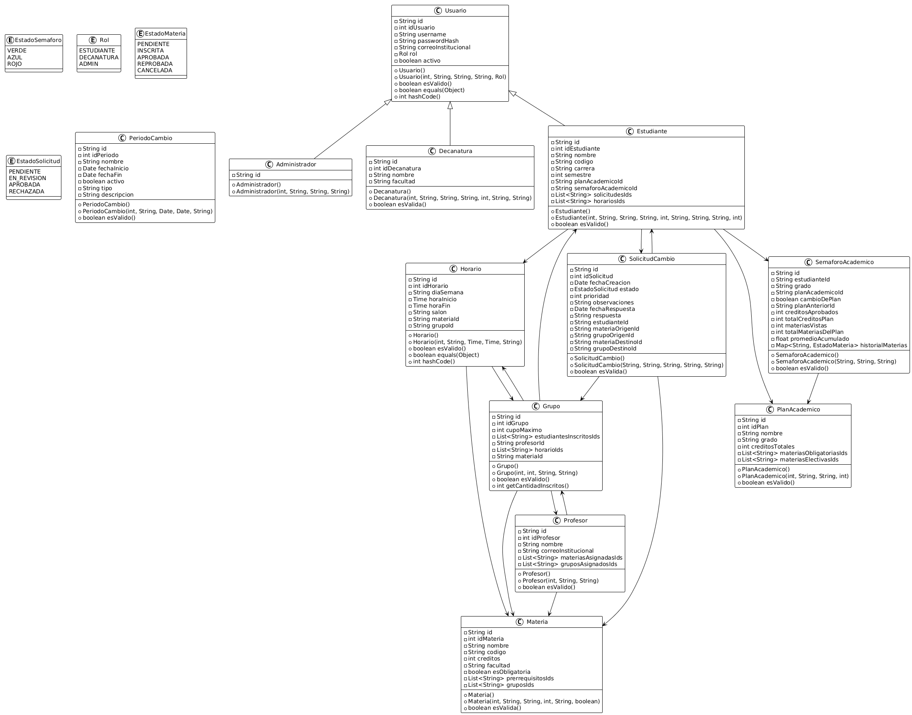

# Sirha BackEnd
A continuación, el desarrollo de los puntos propuestos en la documentación técnica:

---
# Estructura y Flujo de Ramas

## Ramas Principales

###  `origin/main`
- Rama principal de producción
- Contiene el código estable y listo para reléase.
- Solo se actualiza mediante merge desde `develop`.

###  `develop`
- Rama de desarrolo e integración principal
- Contiene las features completadas y probadas
- Sirve como base para nuevas features
- Se mergea a `main` para releases

## Ramas de Feature

### Estructura de Features
Las ramas de feature siguen el patrón: `feature/nombre-feature`

#### Features:
- `feature/classesyMongoDB` - Implementación de clases y configuración MongoDB.
- `feature/controladores` - Desarrollo de la capa y estructuración de  controladores.
- `feature/pruevas-jacoco-sonarqube` - Configuración de pruebas y calidad de código.
- `feature/repositorio` - Desarrollo de la capa y estructuración de repositorio.
- `feature/servicios` - Desarrollo de la capa y estructuración de la capa de servicios, añadiendo lógica de negocio.
- `feature/controller` - Se agregan cambios y estructuracion arquitectura de controladores.
- `feature/refactorizacionDiagramas` - Refactorización y documentación de los diagramas.
- `feature/service` - Se agregan cambios y estructuracion en la arquitectura de servicios.

## Convenciones
- Las ramas feature deben ser descriptivas.
- Siempre actualizar con `develop` antes de merge.
- Usar commits semánticos y descriptivos.
---
## Diseño de los Diagramas
### Diagrama de Contexto
#### Descripción
El diagrama de contexto proporcionado representa la relación fundamental entre el Usuario y el sistema SHIRA para la gestión de Modificaciones académicas. Es un diagrama de contexto simplificado que muestra la interacción principal del sistema.
#### Elementos
- Usuario
- Sirha
- Modificaciones Académica
#### Imagen del Diagrama

### Diagrama de clases
#### Descripción
El diagrama de clases representa la estructura estática del sistema SIRHA, mostrando las clases del paquete model, sus atributos, métodos y las relaciones entre ellas. Este diagrama refleja fielmente la implementación Java proporcionada.
#### Clases
- Clase Base:
    - Usuario: Clase abstracta que representa un usuario del sistema con atributos comunes (id, username, passwordHash, correoInstitucional, rol, activo). Relaciones de herencia con Administrador, Decanatura y Estudiante. 
- Clases Especializada:
    - Administrador: Extiende Usuario, representa usuarios con privilegios administrativos.
    - Decanatura: Extiende Usuario, incluye atributos específicos (idDecanatura, nombre, facultad).
    - Estudiante: Extiende Usuario, contiene información académica (idEstudiante, nombre, codigo, carrera, semestre) y referencias a otras entidades.
- Entidades Académicas:
    - Materia: Representa las materias académicas con sus propiedades (idMateria, nombre, codigo, creditos, facultad, esObligatoria).
    - Grupo: Modela los grupos de clase con cupos y referencias a estudiantes, profesor y horarios.
    - Horario: Define los horarios de clase con día, hora inicio/fin, salon y referencias.
- Gestión de Solicitudes:
    - SolicitudCambio: Gestiona las solicitudes de cambio con estados, prioridad y referencias a estudiante, materias y grupos.
    - PeriodoCambio: Controla los periodos habilitados para cambios.
- Planificación Académica:
    - PlanAcademico: Define los planes de estudio con materias obligatorias y electivas.
    - SemaforoAcademico: Representa el estado académico del estudiante (avance, créditos, promedio).
- Entidades de Soporte:
    - Profesor: Información de profesores y sus asignaciones.
    - Enumeraciones: EstadoSolicitud, EstadoMateria, EstadoSemaforo, Rol.
#### Justificación de Diseño
- Herencia para Usuarios: Se utiliza herencia para evitar duplicación de código en atributos comunes de usuarios.
- Referencias por ID: En lugar de relaciones complejas con @DBRef, se usan referencias por ID para mejor performance en MongoDB.
- Separación de Responsabilidades: Cada clase tiene una responsabilidad única y clara.
- Validaciones Incorporadas: Métodos esValido() en cada clase para mantener la integridad de datos.
- Enumeraciones para Estados: Uso de enums para garantizar consistencia en estados del sistema.
#### Imagen del Diagrama
 
### Diagrama de Casos de Uso
#### Descripción
Representa las funcionalidades del sistema desde la perspectiva de los usuarios, mostrando qué actores pueden realizar qué acciones en el sistema.
#### Actores
- Estudiante
  - Descripción: Usuario principal que realiza solicitudes de cambio de horario
  - Responsabilidades: Gestionar su perfil, crear solicitudes, consultar estados
  - Cantidad: Múltiples (todos los estudiantes de la institución)

- Decanatura
  - Descripción: Usuario administrativo que gestiona y aprueba solicitudes
  - Responsabilidades: Revisar solicitudes, tomar decisiones, generar reportes
  - Restricciones: Solo puede gestionar materias de su facultad

- Administrador
  - Descripción: Usuario con privilegios completos del sistema
  - Responsabilidades: Configuración global, gestión de usuarios, supervisión
  - Cantidad: Limitada (personal administrativo especializado)

### Diagrama de Componentes Generales
#### Descripción
El diagrama de componentes generales representa la arquitectura de tres capas del sistema SIRHA, mostrando los componentes principales y sus relaciones básicas de comunicación. Es una vista de alto nivel que ilustra el flujo de datos entre el frontend, backend y la base de datos.
#### Imagen del Diagrama

### Diagrama de Componentes Específicos
#### Descripción
Este diagrama muestra la arquitectura interna específica del backend Spring Boot del sistema SIRHA, detallando la estructura de capas (Controller-Service-Repository-Model) y las relaciones entre los componentes dentro de cada paquete.
#### Capas de la Arquitectura
1. Capa Controller (Presentation Layer)
    - Propósito: Manejar las requests HTTP y exponer APIs REST
    - Componentes:
      - UsuarioController, EstudianteController, DecanaturaController, etc.
    - Tecnologías: Anotaciones @RestController, @RequestMapping
    - Responsabilidad: Recepción y validación básica de requests
2. Capa Service (Business Layer)
    - Propósito: Contener la lógica de negocio y reglas de aplicación
    - Componentes:
      - UsuarioService, EstudianteService, SolicitudCambioService, etc.
    - Patrón: Interface-Implementation (Service + ServiceImpl)
    - Responsabilidad: Validaciones complejas, coordinación de operaciones
3. Capa Repository (Persistence Layer)
    - Propósito: Abstraer el acceso a la base de datos MongoDB
    - Componentes:
      - UsuarioRepository, EstudianteRepository, MateriaRepository, etc.
    - Tecnologías: Spring Data MongoDB, MongoRepository
    - Responsabilidad: Operaciones CRUD y queries personalizadas
4. Capa Model (Domain Layer)
    - Propósito: Representar las entidades del dominio del sistema
    - Componentes:
      - Usuario, Estudiante, Materia, SolicitudCambio, etc.
      - Anotaciones: @Document, @Id para mapeo MongoDB
      - Responsabilidad: Definir estructura de datos y relaciones
#### Relaciones y Dependencias
Inyección de Dependencias
- Controller → Service: @Autowired de interfaces de servicio
- Service → Repository: @Autowired de interfaces de repositorio
- Repository → Model: Extienden MongoRepository<Model, String>
- 
Relaciones de Herencia entre Módelos
- Estudiante, Decanatura, Administrador heredan de Usuario
- Permite reutilización de atributos comunes y polimorfismo

Relaciones de Referencia
- SolicitudCambio referencia Estudiante, Materia, Grupo
- Grupo referencia Materia y Profesor
- SemaforoAcademico referencia Estudiante y PlanAcademico

Flujo de Datos Típico
1. Request HTTP → Controller (valida formato)
2. Controller → Service (delega lógica de negocio)
3. Service → Repository (accede a datos)
4. Repository → MongoDB (persistencia)
5. MongoDB → Repository → Service → Controller → Response JSON

#### Justificación de Diseño
Separación de Concerns
- Cada capa tiene responsabilidad única
- Facilita testing unitario e independient
- Permite evolución tecnológica por capas

Patrón MVC Adaptado
- Model: Entidades de dominio + Repositories
- View: Controllers REST (API como vista)
- Controller: Manejo de requests/responses

Arquitectura Escalable
- Nuevas entidades siguen el mismo patrón
- Capas desacopladas permiten modificaciones aisladas
- Spring IoC gestiona dependencias automáticamente

Alineación con Spring Boot Best Practices
- Spring Data MongoDB para persistencia
- Dependency Injection para desacoplamiento
- Annotation-based configuration

#### Imagen del Diagrama

### Diagrama de Base de Datos
#### Descripción
Este diagrama representa el esquema de base de datos MongoDB del sistema SIRHA, 100% fiel a la 
implementación real del código. Muestra las collections exactas, campos, tipos de datos y relaciones 
tal como están definidas en las entidades con anotaciones @Document de Spring Data MongoDB.
#### Imagen del Diagrama

### Diagramas de Secuencia 

- Link del repositorio de los diagrama de Secuencia:
  - https://www.pdffiller.com/s/EQNk5O-lGh