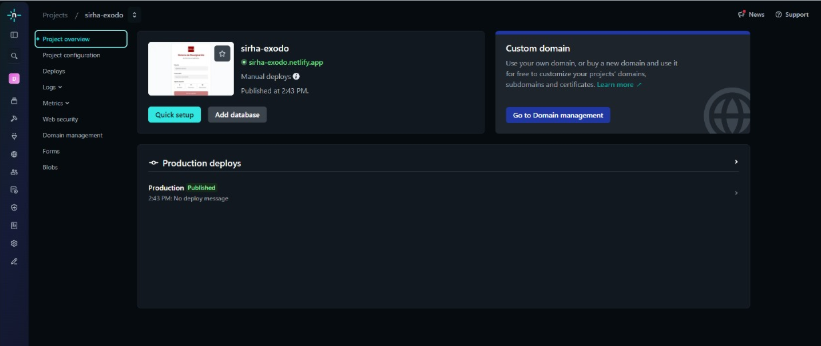

# BackEnd
En este repositorio, va a estar todo el Backend de este proyecto.

## Primeros pasos

para este laboratorio, lo primero es generar un repositorio con Spring Boot, y organizar el pom para que tenga jacoco, 
el maven y el sonarqube y demas.

Lo siguiente fue leer el documento SIRHA, el cual nos dice que es lo que se pide y lo que debemos agregar a este 
repositorio.
## Creando el proyecto

**1 punto**

En este caso el documento nos pedia usar el patron scallfolding, el cual se maneja de la siguiente manera, el

**Controller:** Este paquete se creo para manejar las peticiones HTTP y muestra el API REST que se pide. Tiene la clase
ControladorEstudiantes.

**Model:** Este paquete tiene el funcionamiento de los datos que manejara el sistema. Tiene la clase Estudiante.

**Repository:** Este paquete es la que gestiona el manejo de los datos. Tiene las clases RepositorioEstudiantesMemoria y 
RepositorioEstudiantes

**Service:** Este paquete es el que ya tiene mas encargado el como se manejara el proyecto. Las clases que tiene son 
ServicioEstudiantesImpl y ServicioEstudiantes

## Creamos las siguientes clases

**Clase estudiante:** Esta clase es la que representa a los estudiantes, la que tiene su informacion. Para esta clase se
utiizo el principio Single Responsability.

**Clase repositorioEstudiantes:** Esta es la interfaz para los estudiantes, la cual abstrae las operaciones basicas que
serian las del CRUD. Para esta clase se uso el principio Interface Segregation, el principio Dependency Inversion (los 
servivios dependen de la abstraccion, como ya se habia mencionado).

**Clase RepositorioEstudiantesMemoria:** Esta clase guarda los datos de la clase anterior RepositorioEstudiantes, 
tambien permite hacer el CRUD en la memoria, y si un usuario no tiene un ID, lo coloca automaticamente.
Para esta clase se uso el principio Single Responsability, al solo tener la funcion del alamcenamiento, y se uso el 
principio Liskov Substitution, para reemplazar alguna implementacion de la clase RepositorioEstudiantes.

**Clase servicioCliente:** Esta clase es la interfaz de el servicio que se prestara, en este caso la inscripcion de 
materias. Para esta se usaron los principios Interface Segregation la cual tiene metodos especificos para los 
estudiantes y Dependency Inversion, ya que los controladores dependen de na clase concreta por su abstraccion.

**Clase ServicioClienteImpl:** Esta clase tiene la implementacion del servicio que se realizara, la cual delega al 
repositorio. Para esta clase se usaron los principios Single responsability, por lo que se encarga solo de la logica de 
los estudiantes, Se uso Open/Close, ya que puede extenderse implementando nuevas reglas sin que se tengan que modificar 
la interfaz ni los controladores, y se uso Dependency Inversion, ya que depende de la abstraccion de la clase 
RepositorioEstudiantes.

**Clase ControladorEstudiantes:** Esta clase controla el REST que expone el API. Esta clase uso los principios Single 
Responsability, ya que solo maneja las peticiones HTTP, y Dependency Inversion, ya que depende de la interfaz 
ServicioEstudiantes.

**Clase Main:** Esta clase ya seria la raiz de todo el proyecto, siendo el punto de entrada para Spring Boot. Esta clase
uso el principio Single Responsability, ya que solo inicia el proyecto.

## Capturas Pruebas Funcionamiento

### Jacoco

Para poder llegar a la meta de cobertura, realizamos pruebas en las clases propuestas para demostrar su funcionalidad y 
correcto funcionamiento, para poder ejecutarlas se usó el comando
**mvn clean test**, el cual dentro al ser ejecutado, en la carpeta de tarjet se generan los siguintes archivos:

En el archivo index, obtenemos una url la cual nos dirige al resumen de cobertura de nuestras pruebas de unidad,logrando
en este caso exitosamente la cobertura esperada.

### Sonar Qube

Ejecutamos el comando **mvn sonar:sonar** para correr sonar qube, cuando este ejecutó, nos mostro la cobertura actual de
nuestras pruebas frente al codigo del proyecto actual, mostrando una cobertura del 87.7% la cual supera la meta esperada.

### Swagger 

Swagger tiene la particularidad que solo es posible ejecutarlo cuando se llega a la meta de cobertura de las pruebas del programa,
al culminar y verificar la cobertura esperada, ejecutamos el comando **mvn spring-boot:run** el cual levanta la aplicacion
Spring Boot usando maven, con esto, usamos el puerto que especificamos en la carpeta de properties del projecto y accedememos
al link **http://localhost:8080/swagger-ui/index.html** usando el puerto definido, el cual nos manda directamente a swagger.